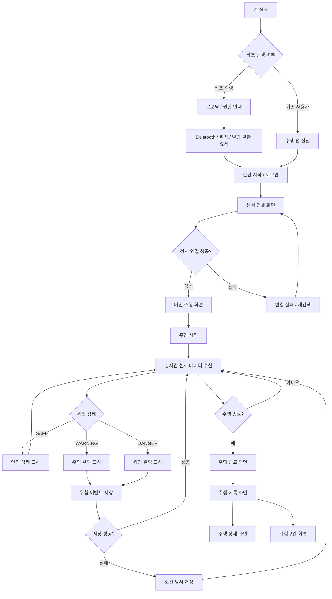

# 사용자용 App IA

## 0. 문서 정보


| 항목    | 내용                                |
| ----- | --------------------------------- |
| 작성자   | 최윤서                               |
| 문서명   | 동행가드 사용자용 App IA v3               |
| 기준 문서 | 동행가드 App PRD v3                   |
| 대상    | 전동 휠체어 이용자                        |
| 작성 목적 | 사용자용 앱의 화면 구조와 핵심 사용 흐름 정의        |
| 포함 범위 | IA, User Flow                     |
| 제외 범위 | ERD, API 상세, BLE 상세 데이터, 관리자 웹 IA |


---

# 1. IA 설계 방향

사용자용 앱은 전동 휠체어 이용자가 **주행 중 위험 상태를 빠르게 인지하고 대응하는 것**이 핵심이다.

따라서 화면 구조는 다음 기준으로 잡는다.


| 기준        | 설명                           |
| --------- | ---------------------------- |
| 주행 중심     | 앱 실행 후 빠르게 센서 연결과 주행 화면으로 진입 |
| 실시간 위험 인지 | 현재 거리값과 위험 상태를 즉시 확인         |
| 단순한 조작    | 고령 사용자도 사용할 수 있도록 버튼과 흐름 최소화 |
| 기록 확인     | 주행 종료 후 위험 발생 내역 확인          |
| 확장 가능성    | 위험 구간 지도, 안전 경로 추천으로 확장 가능   |


---

# 2. 전체 IA 구조

```
동행가드 사용자용 App

├─ 1. 온보딩 / 권한 안내
│  ├─ 서비스 소개
│  ├─ 사용 전 안내
│  └─ 권한 안내
│     ├─ Bluetooth 권한
│     ├─ 위치 권한
│     └─ 알림 권한
│
├─ 2. 시작
│  ├─ 간편 시작
│  └─ 로그인 / 회원가입
│
├─ 3. 주행 탭
│  ├─ 센서 연결 화면
│  │  ├─ 센서 검색
│  │  ├─ 센서 연결 중
│  │  ├─ 연결 완료
│  │  └─ 연결 실패 / 재검색
│  │
│  ├─ 메인 주행 화면
│  │  ├─ BLE 연결 상태
│  │  ├─ 현재 거리값
│  │  ├─ 현재 위험 상태
│  │  │  ├─ SAFE
│  │  │  ├─ WARNING
│  │  │  └─ DANGER
│  │  ├─ 주행 시작
│  │  └─ 주행 종료
│  │
│  ├─ 위험 알림 화면
│  │  ├─ WARNING 알림
│  │  ├─ DANGER 알림
│  │  ├─ 거리값 표시
│  │  └─ 대응 안내
│  │
│  └─ 주행 종료 화면
│     ├─ 종료 확인
│     ├─ 주행 요약
│     └─ 기록 보기
│
├─ 4. 기록 탭
│  ├─ 주행 기록 목록
│  ├─ 주행 상세
│  │  ├─ 주행 시간
│  │  ├─ 위험 이벤트 목록
│  │  └─ 위험 발생 위치
│  └─ 빈 기록 상태
│
├─ 5. 위험구간 탭
│  ├─ 위험 구간 지도
│  ├─ 위험 구간 리스트
│  ├─ 위험도 상세
│  └─ 안전 경로 결과
│
└─ 6. 설정
   ├─ 디바이스 관리
   ├─ 알림 설정
   ├─ 접근성 설정
   └─ 사용자 정보

```

---

# 3. 하단 탭 구조

사용자용 앱은 MVP 기준으로 **3개 탭**으로 구성한다.

```
하단 탭

1. 주행
2. 기록
3. 위험구간

```


| 탭    | 포함 화면                      | 목적                     |
| ---- | -------------------------- | ---------------------- |
| 주행   | 센서 연결, 메인 주행, 위험 알림, 주행 종료 | 실시간 위험 감지와 주행 관리       |
| 기록   | 주행 기록 목록, 주행 상세            | 과거 주행과 위험 이벤트 확인       |
| 위험구간 | 위험 구간 지도, 위험도 상세, 안전 경로 결과 | 누적 위험 구간 및 AI 분석 결과 확인 |


설정은 하단 탭에 넣지 않고, 상단 아이콘 또는 보조 메뉴로 둔다.

---

# 4. MVP 화면 우선순위

## 4.1 1차 구현 화면


| 우선순위 | 화면       | 목적                      |
| ---- | -------- | ----------------------- |
| P0   | 권한 안내 화면 | Bluetooth, 위치, 알림 권한 안내 |
| P0   | 센서 연결 화면 | ESP32 센서 모듈 BLE 연결      |
| P0   | 메인 주행 화면 | 거리값, 위험 상태, 주행 시작/종료 표시 |
| P0   | 위험 알림 화면 | WARNING/DANGER 상황 경고    |
| P0   | 주행 종료 화면 | 주행 종료 및 기록 저장           |


---

## 4.2 2차 구현 화면


| 우선순위 | 화면       | 목적                      |
| ---- | -------- | ----------------------- |
| P1   | 주행 기록 화면 | 과거 주행 목록 확인             |
| P1   | 주행 상세 화면 | 위험 이벤트 목록 및 위치 확인       |
| P1   | 위험 구간 화면 | 누적 위험 구간 또는 AI 분석 결과 확인 |


---

## 4.3 후순위 화면


| 화면          | 처리             |
| ----------- | -------------- |
| 안전 경로 상세 화면 | P1 또는 P2       |
| 디바이스 관리 상세  | P2             |
| 알림/접근성 설정   | P2             |
| 보호자 알림 화면   | 후순위            |
| 관리자 기능      | 관리자용 웹에서 별도 구성 |


---

# 5. User Flow

## 5.1 전체 User Flow

```
앱 실행
→ 온보딩 / 권한 안내
→ 간편 시작 또는 로그인
→ 센서 연결
→ 메인 주행 화면
→ 주행 시작
→ 실시간 센서 데이터 수신
→ 위험 상태 표시
→ 위험 발생 시 알림
→ 위험 이벤트 저장
→ 주행 종료
→ 주행 기록 확인
→ 위험 구간 확인

```

---

## 5.2 User Flow 시각화




---

