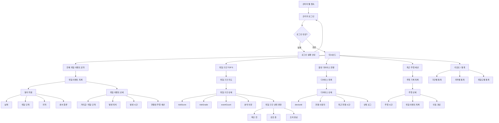

# 관리자용 Web IA

---

## 0. 문서 정보


| 항목    | 내용                                  |
| ----- | ----------------------------------- |
| 작성자   | 최윤서                                 |
| 문서명   | 동행가드 관리자용 Web IA v1                 |
| 기준 문서 | 동행가드 App PRD v3                     |
| 대상    | 관리자 / 운영자 / 지자체 담당자                 |
| 작성 목적 | 관리자용 웹의 화면 구조와 핵심 관리 흐름 정의          |
| 포함 범위 | IA, Admin User Flow                 |
| 제외 범위 | 사용자용 앱 IA, ERD 상세, API 상세, AI 모델 상세 |


---

# 1. IA 설계 방향

관리자용 웹은 사용자 앱과 목적이 다르다.

사용자용 앱은 **실시간 주행 안전 확인**이 핵심이고,

관리자용 웹은 **누적 위험 데이터 조회, 위험 구간 분석, 디바이스·사용자 관리, 운영 모니터링**이 핵심이다.


| 기준          | 설명                                 |
| ----------- | ---------------------------------- |
| 데이터 모니터링 중심 | 위험 이벤트, 위험 구간, 주행 데이터 현황을 확인       |
| 지도 기반 관리    | 위험 발생 위치를 지도에서 확인                  |
| 분석 중심       | 위험도, 발생 빈도, 구간별 위험 수준을 파악          |
| 운영 관리       | 사용자, 디바이스, 센서 상태를 관리               |
| 확장성         | 지자체 대시보드, 위험 구간 리포트, 공공데이터화로 확장 가능 |


---

# 2. 전체 IA 구조

```
동행가드 관리자 Web

├─ 1. 로그인
│  ├─ 관리자 로그인
│  └─ 권한 확인
│
├─ 2. 대시보드
│  ├─ 전체 위험 이벤트 수
│  ├─ 오늘 발생한 위험 이벤트
│  ├─ 위험 구간 TOP 5
│  ├─ 활성 디바이스 수
│  ├─ 최근 주행 세션 수
│  └─ 시스템 상태 요약
│
├─ 3. 위험 이벤트 관리
│  ├─ 위험 이벤트 목록
│  ├─ 이벤트 상세
│  │  ├─ 발생 시간
│  │  ├─ 위험 단계
│  │  ├─ 센서 종류
│  │  ├─ 거리값
│  │  ├─ 위치 정보
│  │  └─ 연결된 주행 세션
│  └─ 이벤트 필터
│     ├─ 날짜
│     ├─ 위험 단계
│     ├─ 센서 종류
│     └─ 지역
│
├─ 4. 위험 구간 관리
│  ├─ 위험 구간 지도
│  ├─ 위험 구간 리스트
│  ├─ 위험도 상세
│  │  ├─ riskScore
│  │  ├─ riskGrade
│  │  ├─ eventCount
│  │  ├─ 최근 발생 시간
│  │  └─ 분석 이유
│  └─ 위험 구간 상태 관리
│     ├─ 확인 전
│     ├─ 검토 중
│     └─ 조치 완료
│
├─ 5. 주행 기록 관리
│  ├─ 주행 세션 목록
│  ├─ 주행 상세
│  │  ├─ 사용자
│  │  ├─ 디바이스
│  │  ├─ 시작/종료 시간
│  │  ├─ 위험 이벤트 수
│  │  └─ 이동 경로
│  └─ 주행별 위험 이벤트
│
├─ 6. 사용자 관리
│  ├─ 사용자 목록
│  ├─ 사용자 상세
│  │  ├─ 기본 정보
│  │  ├─ 연결 디바이스
│  │  ├─ 주행 기록
│  │  └─ 위험 이벤트 이력
│  └─ 사용자 상태 관리
│
├─ 7. 디바이스 관리
│  ├─ 디바이스 목록
│  ├─ 디바이스 상세
│  │  ├─ deviceId
│  │  ├─ 사용자 연결 상태
│  │  ├─ 최근 연결 시간
│  │  ├─ 센서 종류
│  │  └─ 상태 로그
│  └─ 비정상 디바이스 관리
│
├─ 8. AI 분석 관리
│  ├─ AI 분석 결과 목록
│  ├─ 위험 구간 분석 결과
│  ├─ 분석 실행 이력
│  ├─ 분석 기준 관리
│  └─ 위험도 등급 기준
│
├─ 9. 리포트 / 통계
│  ├─ 기간별 위험 이벤트 통계
│  ├─ 지역별 위험도 통계
│  ├─ 센서별 감지 통계
│  ├─ 주행 세션 통계
│  └─ 리포트 다운로드
│
└─ 10. 설정
   ├─ 관리자 계정 관리
   ├─ 권한 관리
   ├─ 위험 단계 기준 설정
   ├─ 알림 설정
   └─ 시스템 설정

```

---

# 3. 관리자 웹 메뉴 구조

관리자 웹은 앱처럼 하단 탭이 아니라 **좌측 사이드바 구조**가 적합하다.

```
사이드바 메뉴

1. 대시보드
2. 위험 이벤트
3. 위험 구간
4. 주행 기록
5. 사용자
6. 디바이스
7. AI 분석
8. 리포트
9. 설정

```


| 메뉴     | 목적                  |
| ------ | ------------------- |
| 대시보드   | 전체 운영 현황 요약         |
| 위험 이벤트 | 개별 위험 감지 데이터 조회     |
| 위험 구간  | 누적 위험 지역 관리         |
| 주행 기록  | 사용자 주행 세션 조회        |
| 사용자    | 사용자 정보 및 이용 이력 관리   |
| 디바이스   | 센서 모듈 연결 상태 관리      |
| AI 분석  | 위험도 분석 결과 확인        |
| 리포트    | 통계 및 보고서 출력         |
| 설정     | 관리자 권한, 기준값, 시스템 설정 |


---

# 4. MVP 화면 우선순위

## 4.1 1차 구현 화면


| 우선순위 | 화면        | 목적                        |
| ---- | --------- | ------------------------- |
| P0   | 관리자 로그인   | 관리자 접근 제어                 |
| P0   | 대시보드      | 전체 위험 현황 요약               |
| P0   | 위험 이벤트 목록 | 앱에서 저장된 위험 이벤트 조회         |
| P0   | 위험 이벤트 상세 | 개별 이벤트의 위치, 거리값, 위험 단계 확인 |
| P0   | 위험 구간 지도  | 누적 위험 위치를 지도 기반으로 확인      |


---

## 4.2 2차 구현 화면


| 우선순위 | 화면       | 목적                   |
| ---- | -------- | -------------------- |
| P1   | 주행 기록 관리 | 주행 세션별 위험 이벤트 확인     |
| P1   | 디바이스 관리  | 센서 모듈 상태 및 사용자 연결 관리 |
| P1   | AI 분석 결과 | 위험 구간 점수와 등급 확인      |
| P1   | 리포트 / 통계 | 기간별, 지역별 위험 통계 확인    |


---

## 4.3 후순위 화면


| 화면                | 처리  |
| ----------------- | --- |
| 사용자 상세 관리         | P2  |
| 관리자 권한 관리         | P2  |
| 위험 기준값 설정         | P2  |
| 리포트 다운로드          | P2  |
| 지자체 제출용 보고서 자동 생성 | 후순위 |
| 조치 이력 관리          | 후순위 |


---

# 5. Admin User Flow

## 5.1 전체 Admin Flow

```
관리자 로그인
→ 대시보드 확인
→ 위험 이벤트 현황 확인
→ 위험 구간 지도 확인
→ 특정 위험 구간 선택
→ 위험 이벤트 상세 확인
→ 주행 기록 또는 디바이스 정보 확인
→ 필요 시 위험 구간 상태 변경
→ 통계/리포트 확인

```

---

## 5.2 Admin Flow 시각화




---

# 6. 관리자 웹 MVP 핵심 흐름

MVP에서는 관리자 기능을 너무 넓히기보다, 아래 흐름을 우선 구현한다.

```
로그인
→ 대시보드
→ 위험 이벤트 목록
→ 위험 이벤트 상세
→ 위험 구간 지도

```

이 흐름만 구현해도 앱에서 저장된 위험 데이터를 관리자가 확인할 수 있다.

---

# 7. 사용자 앱과 관리자 웹 역할 차이


| 구분     | 사용자용 앱           | 관리자용 웹               |
| ------ | ---------------- | -------------------- |
| 주요 목적  | 주행 중 위험 인지와 알림   | 위험 데이터 조회와 관리        |
| 핵심 사용자 | 전동 휠체어 이용자       | 관리자, 운영자, 지자체 담당자    |
| 중심 화면  | 메인 주행 화면         | 대시보드 / 지도            |
| 주요 데이터 | 실시간 거리값, 위험 상태   | 누적 위험 이벤트, 위험 구간     |
| 주요 기능  | 센서 연결, 알림, 기록 확인 | 이벤트 조회, 통계, 위험 구간 관리 |
| 사용 상황  | 이동 중             | 운영/관리 중              |
| UI 방향  | 단순, 큰 버튼, 즉각적 경고 | 정보량 많은 대시보드, 필터, 지도  |


---

